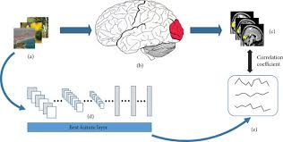

# Visual-Stimulus-Encoding-in-Layer-4-Cortical-Neurons using Allen Institute Dataset

  

# Biological Context

The primary visual cortex (V1) serves as the first cortical stage of visual processing, where neurons transform retinal input into feature representations. Layer 4 (L4) occupies a privileged position in this hierarchy, receiving direct thalamocortical projections from the lateral geniculate nucleus and serving as the main entry point for visual information to the cortex.

# The Experiment: Gratings vs. Nature’s Chaos

Visual neuroscience has traditionally relied on simplified stimuli like static gratings - controlled patterns of oriented bars that permit systematic investigation of fundamental tuning properties such as orientation and spatial frequency selectivity. However, the natural visual environment presents organisms with complex, statistically rich stimuli that may engage different processing mechanisms.

This raises critical questions:

- Do individual neurons participate in encoding both artificial and natural visual stimuli?

- Are population coding strategies conserved across stimulus classes?

- How do these processes vary across cortical layers and cell types?

# Approach we Took

Using the Allen Brain Observatory's large-scale Neuropixels recordings from mouse V1SP, we conducted a comparative analysis of neural responses to:

- Static gratings (orientationand spatial frequency variations)

- Natural scenes (Frames)

# Key Methodological Innovations

Our analytical pipeline combined established neurophysiological approaches with modern computational techniques:

- Dimensionality reduction (PCA) to identify dominant response modes

- Tuning curve characterization for both stimulus classes

- Population coding analysis through correlation matrices

- Cross-stimulus comparison using Spearman's rank correlation

# Repository Contents

This repository contains complete workflows for:

- Data acquisition from the Allen SDK

- Response characterization

- Population-level analysis

- Visualization generation
